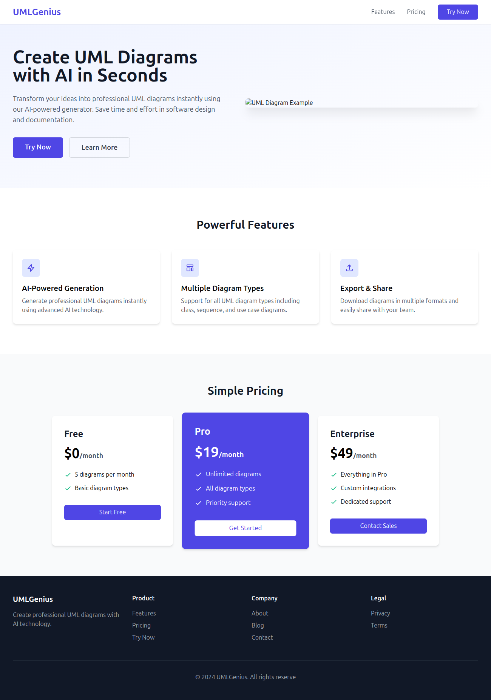
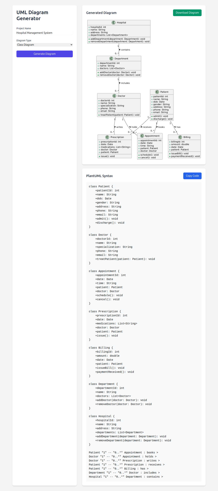
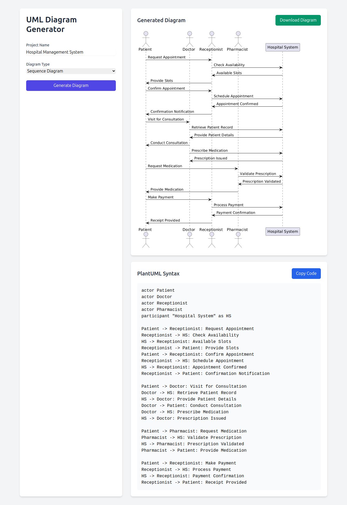
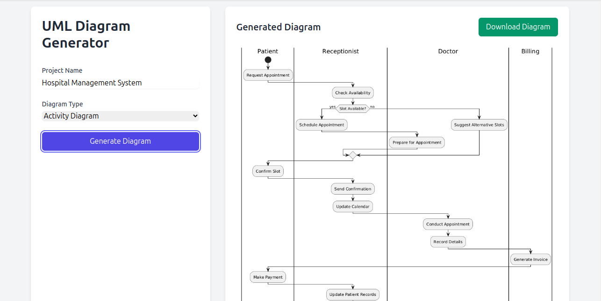

<div id="top">

<p align="center">
  
</p>

<p align="center">
  <em>Generate UML diagrams effortlessly with AI-powered automation and Flask integration.</em>
</p>

<p align="center">
  <a href="https://github.com/mfoud444/UML-AI-Generator/actions">
    
  </a>
  <a href="https://github.com/mfoud444/UML-AI-Generator">
    
  </a>
  <a href="https://opensource.org/licenses/MIT">
    
  </a>
</p>

</div>


# UML Diagram Generator Web Application

**[Quick Link to Repository](https://github.com/mfoud444/UML-AI-Generator.git)**  

Generate professional UML diagrams in seconds! This web application uses Flask and the g4f AI API to automate the creation of UML diagrams. Users can input a project name, select a diagram type, and instantly view the generated diagram in an easy-to-use interface.

---

## Key Features

### 🚀 **User Input Form**
- **Project Name:** Field to input the project name.  
- **Diagram Type:** Dropdown menu to select the UML diagram type:
  - Sequence Diagram
  - Use Case Diagram
  - Class Diagram
  - Object Diagram
  - Activity Diagram
  - Component Diagram
  - Deployment Diagram
  - State Diagram
  - Timing Diagram

### ⚙️ **Diagram Generation Workflow**
- Form submission triggers:
  1. AI prompt creation based on user input.
  2. g4f AI API generates PlantUML syntax.
  3. Syntax is converted into a UML diagram image using PlantUML.

### 🖼️ **Output Display**
- Generated UML diagram is displayed as an image in the interface.

---

## Screenshots

### 🖼️ Example Interface
<p align="center">
  
</p>
<p align="center"><em>The main interface</em></p>


### 🖼️ Example Diagram Outputs
<div align="center">
  <table>
    <tr>
      <td align="center">
        
        <br>
        <em>Sequence Diagram</em>
      </td>
      <td align="center">
        
        <br>
        <em>Class Diagram</em>
      </td>
      <td align="center">
        
        <br>
        <em>Activity Diagram</em>
      </td>
    </tr>
  </table>
</div>
<p align="center"><em>Sample UML diagrams generated by the application.</em></p>

---

## Implementation Details

### 🛠️ **Technology Stack**
- **Flask Framework:** Handles routing and rendering.
- **g4f AI API:** Generates PlantUML syntax based on user input.
- **PlantUML:** Converts syntax to UML diagram images.

### 💡 **Error Handling**
- Handles:
  - Invalid inputs.
  - API errors or timeouts.
  - Diagram generation issues.

---

## Requirements

### 🔧 **Setup**
- Python 3.x  
- Flask  
- g4f AI API credentials  
- PlantUML installed or PlantUML server access  

---

## Installation

1. Clone this repository:  
   ```bash
   git clone https://github.com/mfoud444/UML-AI-Generator.git
   cd UML-AI-Generator
   ```

2. Install dependencies:  
   ```bash
   pip install -r requirements.txt
   ```

3. Set up g4f AI API credentials.

4. Run the Flask application:  
   ```bash
   python app.py
   ```

5. Access the app at:  
   `http://127.0.0.1:5000/`

---

## Directory Structure

```
.
├── app.py                # Main application file
├── templates/            # HTML templates
│   ├── index.html         # Main page template
├── static/               # Static assets (CSS, JS, images)
│   └── styles.css         # Custom styles
├── screenshots/          # Screenshots for documentation
│   ├── interface.png
│   ├── output.png
│   ├── mobile-view.png
├── requirements.txt      # Dependencies
└── README.md             # Project documentation
```

---

## Contributing

Contributions are welcome! Follow these steps:  
1. Fork the repository.  
2. Create a feature branch:  
   ```bash
   git checkout -b feature-name
   ```  
3. Commit your changes and push to your fork.  
4. Submit a pull request.

---

## License

This project is open-source and licensed under the [MIT License](https://opensource.org/licenses/MIT).

